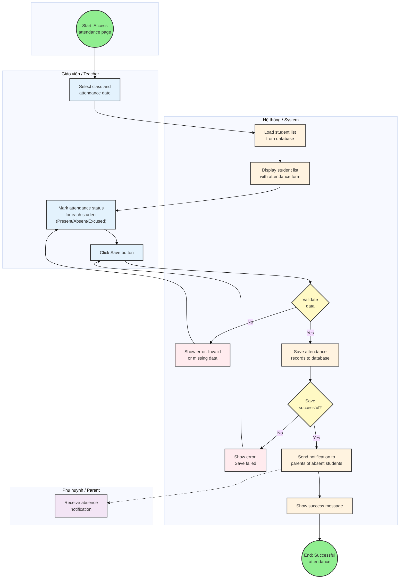
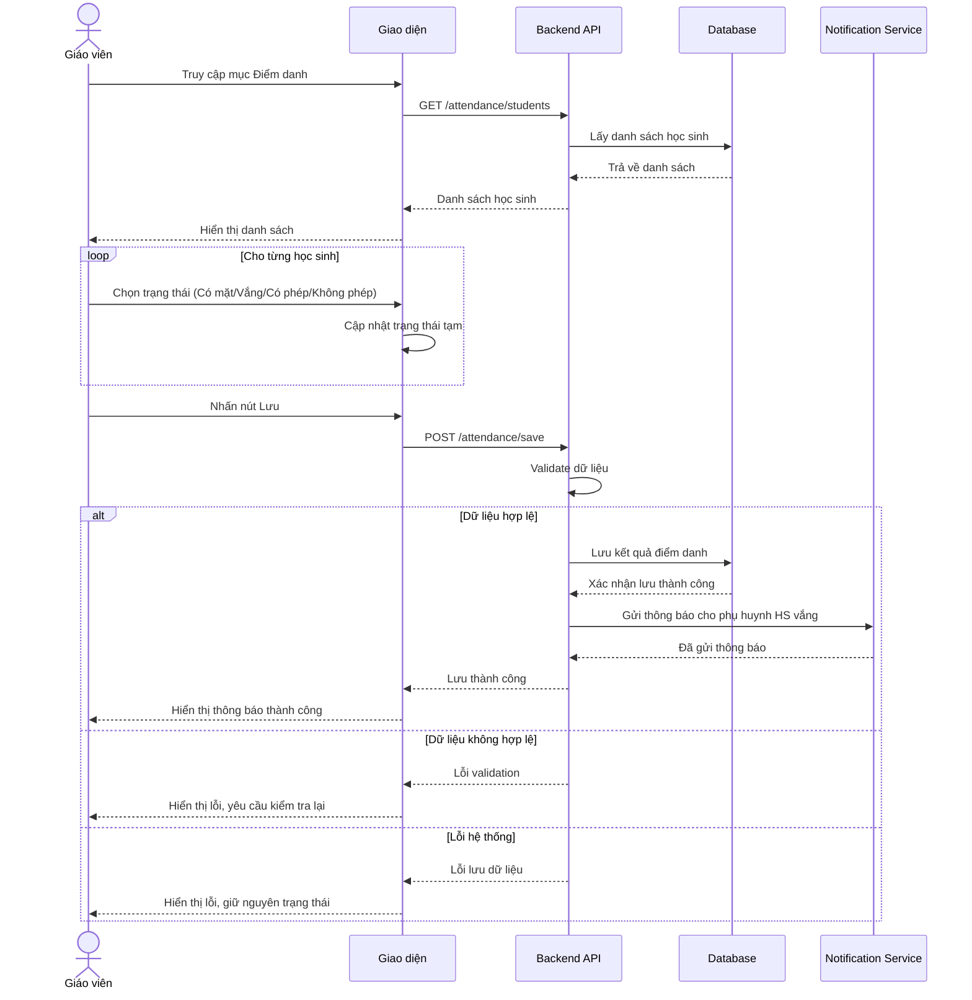
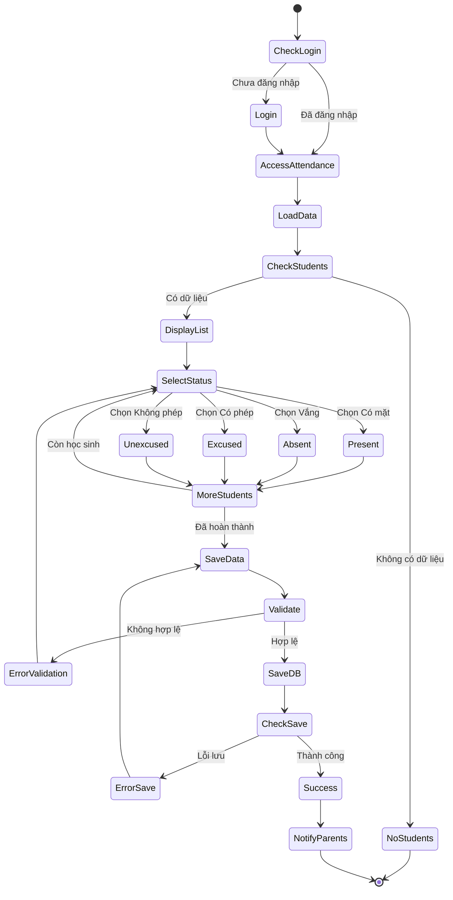

# Attendance Workflow - Quy trình điểm danh học sinh

## Main Workflow Diagram (Swimlane)

## Sequence Diagram

## Activity Diagram (Chi tiết)

## Giải thích các bước:

### 1. Khởi đầu
- Giáo viên đăng nhập hệ thống
- Truy cập mục "Điểm danh"

### 2. Tải dữ liệu
- Hệ thống tải danh sách học sinh trong lớp
- Kiểm tra dữ liệu có tồn tại

### 3. Điểm danh
- Hiển thị danh sách học sinh
- Giáo viên chọn trạng thái cho từng học sinh:
  - **Có mặt**: Học sinh có mặt đầy đủ
  - **Vắng**: Học sinh vắng mặt
  - **Có phép**: Học sinh xin phép trước
  - **Không phép**: Học sinh vắng không phép

### 4. Lưu kết quả
- Giáo viên nhấn nút "Lưu"
- Hệ thống validate dữ liệu
- Lưu vào database

### 5. Thông báo
- Hệ thống tự động gửi thông báo cho phụ huynh của học sinh vắng mặt
- Hiển thị thông báo thành công cho giáo viên

### 6. Xử lý lỗi
- **Lỗi validation**: Yêu cầu giáo viên kiểm tra lại
- **Lỗi lưu dữ liệu**: Giữ nguyên trạng thái, cho phép thử lại

## Các trạng thái điểm danh

| Trạng thái | Mô tả | Hành động hệ thống |
|-----------|-------|-------------------|
| Có mặt | Học sinh có mặt đầy đủ | Không thông báo |
| Vắng | Học sinh vắng mặt | Gửi thông báo phụ huynh |
| Có phép | Học sinh xin phép trước | Ghi nhận, có thể thông báo |
| Không phép | Học sinh vắng không phép | Gửi cảnh báo phụ huynh |

## Liên quan Use Cases
- **UC-T-003**: Ghi nhận điểm danh học sinh (Teacher)
- **UC-P-002**: Xem thông tin điểm danh con (Parent)
- **UC-P-003**: Gửi đơn xin phép nghỉ học (Parent)
