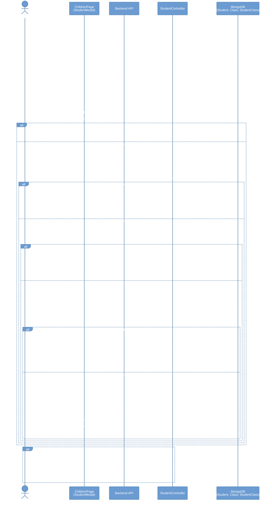

# Sequence Diagram - Thêm học sinh mới

```mermaid
%%{init: {'theme':'base', 'themeVariables': { 'primaryColor':'#6B9BD1','primaryTextColor':'#fff','primaryBorderColor':'#4A7BA7','lineColor':'#4A7BA7','secondaryColor':'#6B9BD1','tertiaryColor':'#6B9BD1','actorBkg':'#6B9BD1','actorBorder':'#4A7BA7','actorTextColor':'#fff','actorLineColor':'#4A7BA7','signalColor':'#fff','signalTextColor':'#fff','labelBoxBkgColor':'#6B9BD1','labelBoxBorderColor':'#4A7BA7','labelTextColor':'#fff','loopTextColor':'#fff','noteBorderColor':'#4A7BA7','noteBkgColor':'#6B9BD1','noteTextColor':'#fff','activationBorderColor':'#4A7BA7','activationBkgColor':'#8AB4E3','sequenceNumberColor':'#fff','fontSize':'18px'}}}%%
sequenceDiagram
    actor Admin as School Admin
    participant Page as ChildrenPage<br/>(StudentModal)
    participant API as Backend API
    participant Ctl as StudentController
    participant DB as MongoDB<br/>(Student, Class, StudentClass)

    Admin->>Page: 1. Open "Quản lý học sinh"
    Page->>API: 2. GET /classes
    API->>Ctl: 3. Fetch classes
    Ctl->>DB: 4. Query classes
    DB-->>Ctl: 5. Return classes
    Ctl-->>API: 6. Classes data
    API-->>Page: 7. Classes list
    Page-->>Admin: 8. Display form with classes

    Admin->>Page: 9. Click "Thêm học sinh"
    Admin->>Page: 10. Fill form & Submit<br/>(full_name, dob, gender, class_id)
    Page->>Page: 11. validate()

    alt Validation fails
        Page-->>Admin: Show validation errors
    else Validation passes
        Page->>API: 12. POST /student
        API->>Ctl: 13. createStudent(req, res)
        
        Ctl->>Ctl: 14. Validate required fields
        alt Missing required fields
            Ctl-->>API: 400 - Thiếu thông tin
            API-->>Page: Error response
            Page-->>Admin: Show "Thiếu thông tin bắt buộc"
        else Fields valid
            Ctl->>DB: 15. ClassModel.findById(class_id)
            DB-->>Ctl: 16. Class data or null
            
            alt Class not found
                Ctl-->>API: 404 - Class not found
                API-->>Page: Error response
                Page-->>Admin: Show "Không tìm thấy lớp học"
            else Class exists
                Ctl->>DB: 17. Student.create(data)
                DB-->>Ctl: 18. New student with _id
                
                Ctl->>DB: 19. Check duplicate enrollment<br/>StudentClass.find() + ClassModel.find()
                DB-->>Ctl: 20. Existing classes in same year
                
                alt Student already in another class
                    Ctl->>DB: 21. Student.findByIdAndDelete()
                    Ctl-->>API: 400 - Duplicate enrollment
                    API-->>Page: Error response
                    Page-->>Admin: Show "Học sinh đã có lớp khác"
                else No conflict
                    Ctl->>DB: 22. StudentClass.create()
                    DB-->>Ctl: 23. Success
                    Ctl-->>API: 201 - Created successfully
                    API-->>Page: Success response
                    Page->>Page: 24. onSuccess() - Refresh list
                    Page-->>Admin: Show success message
                end
            end
        end
    end

    alt Server error
        Ctl-->>API: 500 - Internal error
        API-->>Page: Error response
        Page-->>Admin: Show "Lỗi máy chủ"
    end
```

